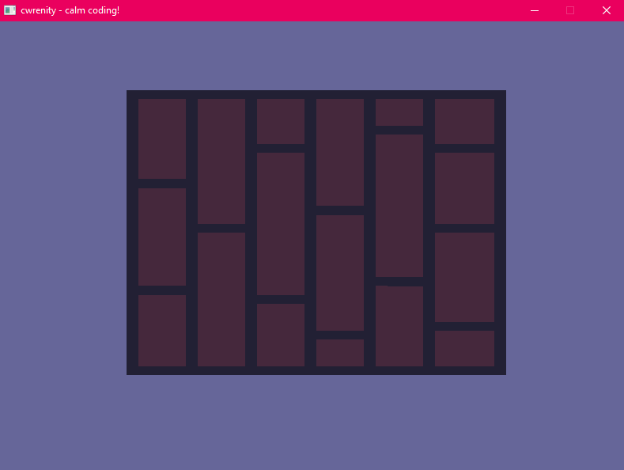

# Cwrenity

  

# Simple game creation
Written in pure C11, Cwrenity is a lightweight, data-oriented game framework!

# No dependencies
Everything is contained! No external dependencies!

  
   

# Opengl rendering
Cwrenity takes advantage of opengl for cross-platform, hardware accelerated rendering

## Roadmap
- [x] App, Windowing Creation
- [x] Native API Layer
- [ ] Opengl Abstraction Layer
- [ ] User Input
- [ ] 2D Rendering
- [ ] 3D Rendering
